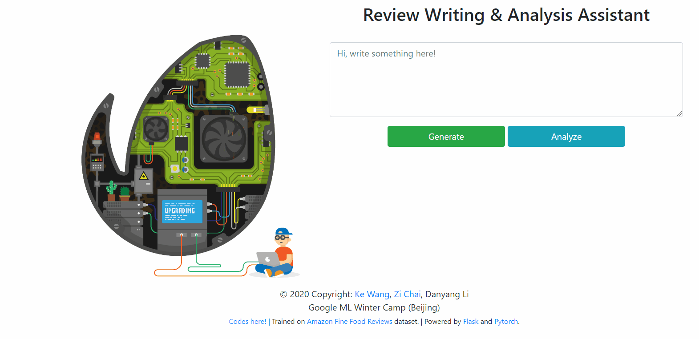

# Review Analysis & Writing Assistant

> Google ML Winter Camp (Beijing) 2020 Project 
>
> Group Member: Ke Wang, Zi Chai and Danyang Li

## Introduction
In the field of Natural Language Learning (NLP), we focus on explaining “why this prediction is make by a black-box Machine Learning (ML) model” and making more non-exporters enjoy the convenience brought by ML models.

We build a review assistant based on the “Amazon Fine Food Reviews” Dataset.
- For review analysis: it performs sentiment analysis & useful analysis.
- For review writing: it performs auto-completion & summarization.

Our highlights:
- We develop an visualization system to interpret the results of our review analysis models.

---

- Our system can perform on-time auto-completion and summarization in an user-friendly way.

## How to use ?

### Requirement
- Pytorch >=1.0
- Python > 3.0
- Flask 

### Directory description

<pre><code>Root
├─datasets/*        Store the data files used by models.
├─code_sentiment/*      Store the source code of sentiment prediction models.
├─code_useful/*      Store the source code of usefulness prediction models.
├─code_generation/*      Store the source code of GPT LM models.
├─code_summary/*      Store the source code of pointer-generator summary models.
└─website/*     Store the source code of website.
</code></pre>

### Run:

	cd website/
	python main.py 

Open your browser and visit the URL of http://localhost/.

